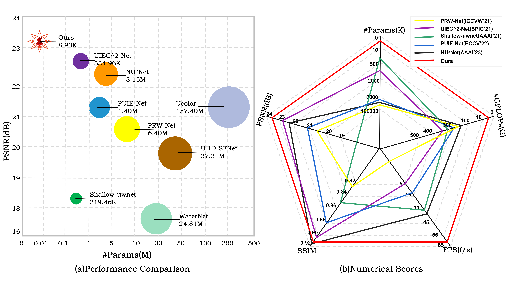

# BMVC'23 FiveA+Network: You Only Need 9K Parameters for Underwater Image Enhancement

This is the office implementation of ***FiveA+Network: You Only Need 9K Parameters for Underwater Image Enhancement, BMVC2023.***

***Jingxia Jiang, Tian Ye, Jinbin Bai, Sixiang Chen, Wenhao Chai, Jun Shi, Yun Liu, Erkang Chen***

***JMU｜ HKUST(GZ)｜NUS｜ZJU｜XJU｜SWU***

[Arxiv](https://arxiv.org/abs/2305.08824)

<hr />




> **Abstract:** *A lightweight underwater image enhancement network is of great significance for resource-constrained platforms, but balancing model size, computational efficiency, and enhancement performance has proven difficult for previous approaches. In this work, we propose the Five A+ Network （FA+Net）, a highly efficient and lightweight real-time underwater image enhancement network with only 9k parameters and ~0.01s processing time. The FA+Net employs a two-stage enhancement structure. The strong prior stage aims to decompose challenging underwater degradations into sub-problems, while the fine-grained stage incorporates multi-branch color enhancement module and pixel attention module to amplify the network's perception of details. To the best of our knowledge, FA+Net is the only network with the capability of real-time enhancement of 1080P images. Thorough extensive experiments and comprehensive visual comparison, we show that FA+Net outperforms previous approaches by obtaining state-of-the-art performance on multiple datasets while significantly reducing both parameter count and computational complexity.* 

<hr />


## TODO List
- [x] Testing Code&Checkpoint
- [x] Model.py
- [x] Train.py

## Installation
Our FA+ Net is built in Pytorch1.11.0, we train and test it ion Ubuntu20.04 environment (Python3.8, cuda11.3).
For installing, please follow these intructions.

```
conda create -n py38 python=3.8
conda activate py38
conda install pytorch=1.12 
pip install opencv-python tqdm ....
```

## Model Testing
**You can find the model weights under the model folder: α=0.1 and α=0.4 respectively.**
Run the following commands:
```
python3  test.py --dataset dataset_path --save_path save_path  --model_path model_path 
```
The rusults will be saved in ./savepath/dataset_type/

## Contact
**Jingxia Jiang: 202021114006@jmu.edu.cn** 

Tian Ye: maserowen718@gmail.com 

Sixiang Chen: 201921114013@jmu.edu.cn


## Citation
```bibtex
@article{jiang2023five,
  title={Five A $\^{}$\{$+$\}$ $ Network: You Only Need 9K Parameters for Underwater Image Enhancement},
  author={Jiang, Jingxia and Ye, Tian and Bai, Jinbin and Chen, Sixiang and Chai, Wenhao and Jun, Shi and Liu, Yun and Chen, Erkang},
  journal={arXiv preprint arXiv:2305.08824},
  year={2023}
}
```

